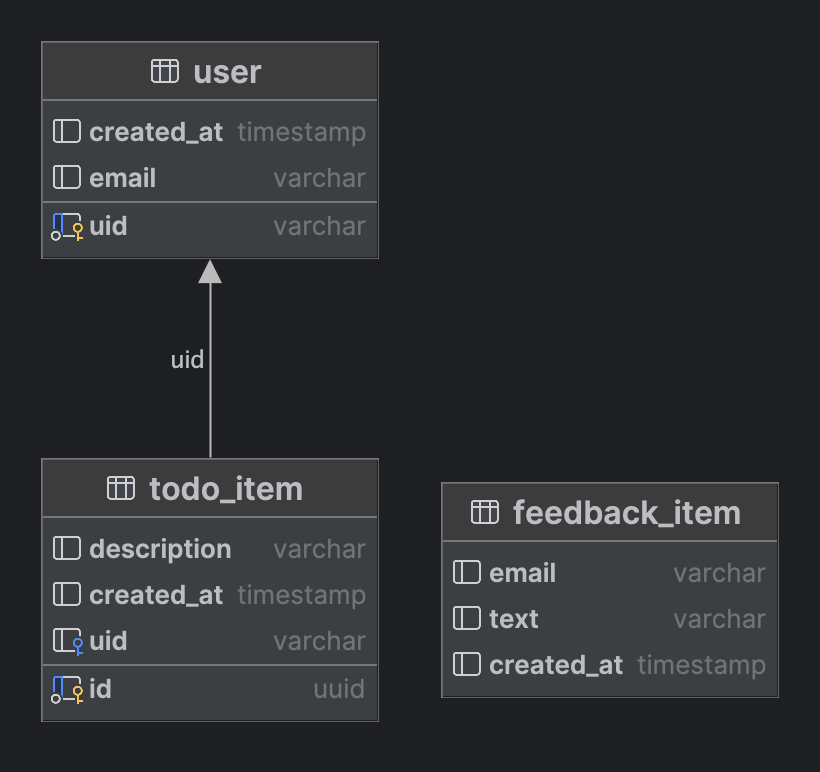

Krivenko Andrei

[render](https://web-confleux.onrender.com)

[swagger](https://web-confleux.onrender.com/swagger/index.html)

DB:

```sql
feedback_item: table
    + columns
        email: varchar
        text: varchar
        created_at: timestamp default CURRENT_TIMESTAMP
todo_item: table
    + columns
        description: varchar
        id: uuid NN
        created_at: timestamp default CURRENT_TIMESTAMP
        uid: varchar
    + indices
        todo_item_pk: unique (id)
    + keys
        todo_item_pk: PK (id)
    + foreign-keys
        todo_item_user_uid_fk: foreign key (uid) -> user[.user_pk] (uid)
user: table
    + columns
        uid: varchar NN
        created_at: timestamp default CURRENT_TIMESTAMP
        email: varchar
    + indices
        user_pk: unique (uid)
    + keys
        user_pk: PK (uid)

```


